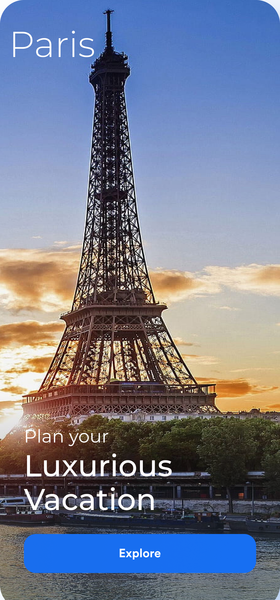
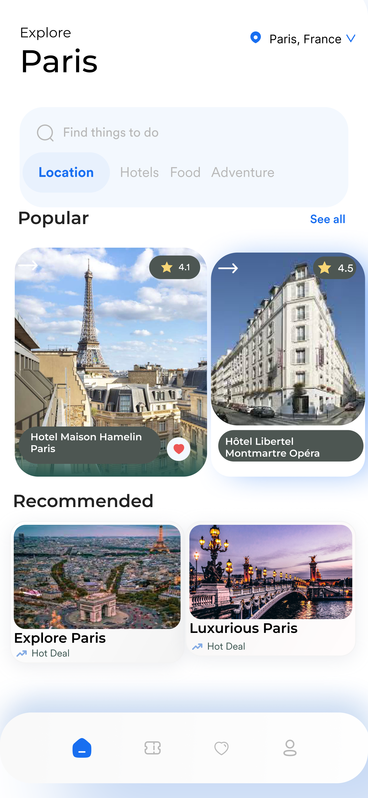
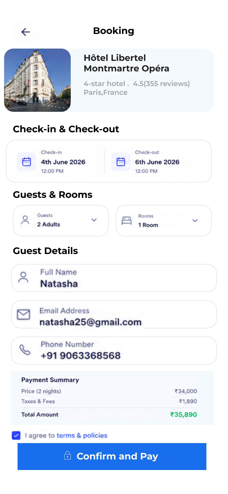
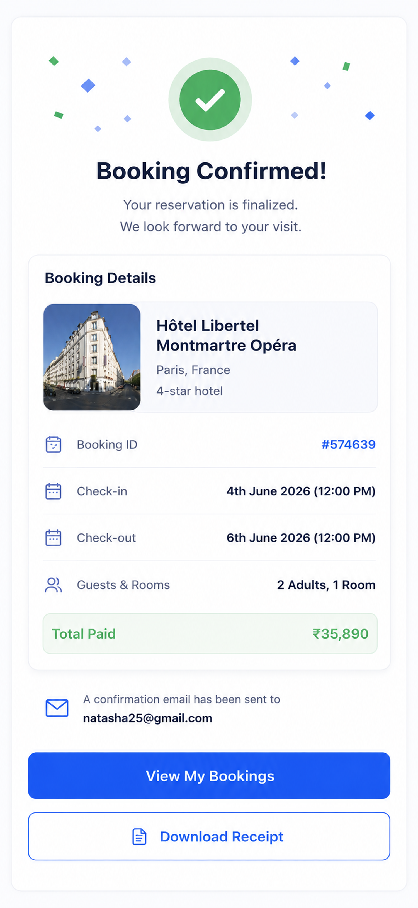

# Hotel Booking Mobile App UI
## Overview
This project is a modern hotel booking mobile application interface designed in Figma. The goal was to create a clean, intuitive, and visually appealing user experience while maintaining consistency throughout the booking journey.
## Objective
Design a mobile application interface focusing on:
- Layout and spacing
- Visual hierarchy
- Usability
- User interaction flow
- Modern UI design principles
## User Flow
Home → Explore → Hotel Details → Booking → Confirmation
## Screens
### Home Screen
Introduces a featured destination and encourages users to explore travel options.
### Explore Screen
Displays popular and recommended destinations in a clean, card-based layout.
### Hotel Details Screen
Provides hotel information, facilities, pricing, and booking options.
### Booking Screen
Allows users to review reservation details and complete the booking process.
### Confirmation Screen
Displays booking confirmation and reservation summary after successful payment.
## Tools Used
- Figma
## Prototype
[View Interactive Prototype](https://www.figma.com/proto/8k24MPH6UZkiHBLUArwxPJ/Hotel-Booking-App?node-id=0-1&t=c3PFW3uywlRhyEM2-1)
**Note:** The interactive prototype provides the intended viewing experience and navigation flow between screens. Some preview images may appear slightly cropped or misaligned due to the device frame used during presentation. The prototype displays the complete design as intended.
## Project Preview
### Home

### Explore

### Hotel Details

### Booking

### Confirmation

## Final Outcome
Created a complete hotel booking application flow with a focus on usability, consistency, spacing, and modern mobile UI design.|
saving it
